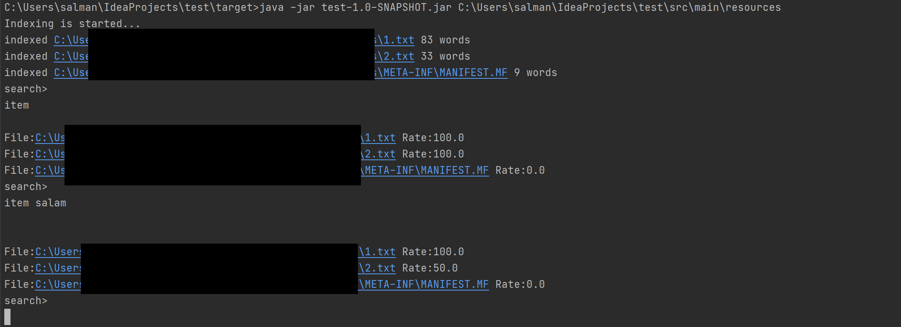

# Simple Inverted Index in Java 
 This command-line app gets a folder and reads all files, and indexes their words. Then gets several words and sends back found path and rank of each file. 
 
 ## usage 

java -jar test-SNAPSHOT.jar PathToTargetDirectory

## Build

This project is based on Maven.

## Screenshot

